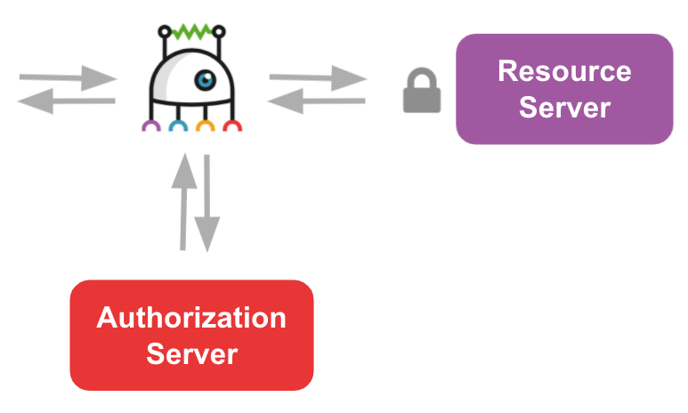

# OAuth2 Client Credentials Flow

In this example we learn how to configure Couper to automatically request an access token for a third-party API using the OAuth2 client credentials grant.



OAuth2 defines (at least) three parties:
* the resource server providing resources (e.g. an API) protected by access tokens,
* the client requesting the resources,
* and the authorization server providing the access tokens.

Usually, Couper acts only as the OAuth2 client but in this example, we use Couper for all three parties.

**(Please jump to the bottom of the page to learn how to configure Couper in a real world setting)**

First, we define two `server` blocks in `couper.hcl`, one for the client:

```hcl
server "client" {
  hosts = ["localhost:8080"]
  api {
    endpoint "/foo" {
      proxy {
        backend {
          origin = "http://localhost:8081"
          path = "/resource"
        }
      }
    }
  }
}
```

and another for the resource server:

```hcl
server "resource-server" {
  hosts = ["localhost:8081"]
  api {
    endpoint "/resource" {
      response {
        json_body = {"foo" = 1}
      }
    }
  }
}
```

We start Couper and send a request to the client endpoint:

```sh
$ curl -is localhost:8080/foo
HTTP/1.1 200 OK
Connection: close
Content-Type: application/json
Date: Fri, 07 May 2021 15:36:54 GMT
Server: couper.io
Vary: Accept-Encoding
Vary: Accept-Encoding
Content-Length: 9

{"foo":1}
```

We see three new log entries. The first is the request to the resource server in its access log:  

```json
{"build":"dde67d7","bytes":9,"client_ip":"127.0.0.1","endpoint":"/resource","handler":"api","level":"info","message":"","method":"GET","proto":"HTTP/1.1","realtime":"0.416","request":{"addr":"localhost:8081","headers":{"accept":"*/*","user-agent":"curl/7.67.0"},"host":"localhost","path":"/resource","port":"8081","tls":false},"response":{"bytes":9,"headers":{"content-type":"application/json"}},"scheme":"http","server":"resource-server","status":200,"timestamp":"2021-05-07T15:36:54Z","type":"couper_access","uid":"c2alt5ig9jseb1ednotg","url":"http://localhost:8081/resource","version":"master"}
```
The second is the same request in the client's backend log:
```json
{"backend":"default","build":"dde67d7","level":"info","message":"","realtime":"1.614","request":{"addr":"localhost:8081","headers":{"accept":"*/*","user-agent":"curl/7.67.0"},"host":"localhost","method":"GET","name":"default","path":"/foo","port":"8081","proto":"HTTP/1.1","scheme":"http"},"response":{"headers":{"content-type":"application/json"},"proto":"HTTP/1.1","tls":false},"status":200,"timestamp":"2021-05-07T15:36:54Z","timings":{"connect":"0.150","dns":"0.374","ttfb":"0.708"},"type":"couper_backend","uid":"c2alt5ig9jseb1ednot0","url":"http://localhost:8081/resource","version":"master"}
````
And the third is the request to the client in its access log:
```json
{"build":"dde67d7","bytes":9,"client_ip":"172.17.0.1","endpoint":"/foo","handler":"api","level":"info","message":"","method":"GET","proto":"HTTP/1.1","realtime":"2.125","request":{"addr":"localhost:8080","headers":{"accept":"*/*","user-agent":"curl/7.67.0"},"host":"localhost","path":"/foo","port":"8080","tls":false},"response":{"bytes":9,"headers":{"content-type":"application/json"}},"scheme":"http","server":"client","status":200,"timestamp":"2021-05-07T15:36:54Z","type":"couper_access","uid":"c2alt5ig9jseb1ednot0","url":"http://localhost:8080/foo","version":"master"}
```

Now we protect the resource at the resource server API with a `jwt` access control:

(please uncomment in `couper.hcl`)
```hcl
...
server "resource-server" {
  hosts = ["localhost:8081"]
  api {
    access_control = ["token"]   # protect the resource server's api
    endpoint "/resource" {
      response {
        json_body = {"foo" = 1}
      }
    }
  }
}
definitions {
  jwt "token" {
    signature_algorithm = "HS256"
    key = "$eCr3T"
    header = "Authorization"
  }
}
```

We restart Couper and try again the previous request:

```sh
$ curl -is localhost:8080/foo
HTTP/1.1 401 Unauthorized
Connection: close
Content-Type: application/json
Couper-Error: access control error
Date: Fri, 07 May 2021 15:37:36 GMT
Server: couper.io
Vary: Accept-Encoding
Vary: Accept-Encoding
Content-Length: 146

{
  "error": {
    "id":      "c2altg6jsr9gcdiijvp0",
    "message": "access control error",
    "path":    "/resource",
    "status":  401
  }
}
```
Corresponding log entry:
```json
{"build":"dde67d7","bytes":146,"client_ip":"127.0.0.1","endpoint":"","error_type":"jwt_token_missing","level":"error","message":"access control error: token: token required","method":"GET","proto":"HTTP/1.1","realtime":"0.105","request":{"addr":"localhost:8081","headers":{"accept":"*/*","user-agent":"curl/7.67.0"},"host":"localhost","path":"/resource","port":"8081","tls":false},"response":{"bytes":146,"headers":{"content-type":"application/json"}},"scheme":"http","server":"resource-server","status":401,"timestamp":"2021-05-07T15:37:36Z","type":"couper_access","uid":"c2altg6jsr9gcdiijvp0","url":"http://localhost:8081/resource","version":"master"}
```

We get a `401` because our request did not contain a token. Yet!

We add a third `server` block to emulate a simple OAuth2 authorization server. It contains an endpoint creating a token response with a JWT expiring after 10 seconds. (A real authorization server will of course do a lot of checks before creating the response, but we skip that here for simplicity)


```hcl
server "authorization-server" {
  hosts = ["localhost:8082"]
  endpoint "/token" {
    response {
      json_body = {
        "access_token" = jwt_sign("token", {  })
        "expires_in" = 10
      }
    }
  }
}
...
definitions {
  jwt_signing_profile "token" {
    signature_algorithm = "HS256"
    key = "$eCr3T"
    ttl = "10s"
  }
  ...
```

Now we reference this token endpoint in an `oauth2` block that we add to the `backend` in the "client" `server` block:

```hcl
...
    endpoint "/foo" {
      proxy {
        backend {
          origin = "http://localhost:8081"
          path = "/resource"
          oauth2 {
            grant_type = "client_credentials"
            token_endpoint = "http://localhost:8082/token"
            client_id = "my-client"
            client_secret = "my-client-secret"
          }
        }
...
```

We restart Couper and try again the previous request:

```sh
$ curl -is localhost:8080/foo
HTTP/1.1 200 OK
Connection: close
Content-Type: application/json
Date: Fri, 07 May 2021 15:38:23 GMT
Server: couper.io
Vary: Accept-Encoding
Vary: Accept-Encoding
Content-Length: 9

{"foo":1}
```

If we now look at the logs, we see five log entries.

The first is the token request in the authorization server's access log:
```json
{"auth_user":"my-client","build":"dde67d7","bytes":140,"client_ip":"127.0.0.1","endpoint":"/token","handler":"endpoint","level":"info","message":"","method":"POST","proto":"HTTP/1.1","realtime":"0.616","request":{"addr":"localhost:8082","headers":{},"host":"localhost","path":"/token","port":"8082","tls":false},"response":{"bytes":140,"headers":{"content-type":"application/json"}},"scheme":"http","server":"authorization-server","status":200,"timestamp":"2021-05-07T15:38:23Z","type":"couper_access","uid":"c2altrtnb4g11ke0bndg","url":"http://localhost:8082/token","version":"master"}
```
And the second in the client's backend log representing the token request sent by Couper (because it had no (valid) token):
```json
{"auth_user":"my-client","backend":"default","build":"dde67d7","level":"info","message":"","realtime":"2.131","request":{"addr":"localhost:8082","headers":{},"host":"localhost","method":"POST","name":"default","path":"","port":"8082","proto":"HTTP/1.1","scheme":"http"},"response":{"headers":{"content-type":"application/json"},"proto":"HTTP/1.1","tls":false},"status":200,"timestamp":"2021-05-07T15:38:23Z","timings":{"connect":"0.200","dns":"0.413","ttfb":"1.060"},"token_request":"oauth2","type":"couper_backend","uid":"c2altrtnb4g11ke0bnd0","url":"http://localhost:8082/token","version":"master"}
```

If we retry the request within 10 seconds,

```sh
$ curl -is localhost:8080/foo
HTTP/1.1 200 OK
Connection: close
Content-Type: application/json
Date: Fri, 07 May 2021 15:38:30 GMT
Server: couper.io
Vary: Accept-Encoding
Vary: Accept-Encoding
Content-Length: 9

{"foo":1}
```

we do not see any entries for a token request in the log, because Couper already has a valid token.

But if we wait for more than 10 seconds, the token is expired and again we see five log entries containing the request for a new token.

## How to use the oauth2 block in a real world setting 

In a real-world setting, use the `oauth2` block in your backend configuration for the
third-party API that needs a token available via the client credentials flow and configure the parameters `token_endpoint`, `client_id` and `client_secret` accordingly:


```hcl
...
        backend {
          origin = "https://example.com"
          path = "/protected_resource"
          oauth2 {
            grant_type = "client_credentials"
            token_endpoint = "..."
            client_id = "..."
            client_secret = "..."
          }
        }
...
```

By default, Couper uses basic authentication to authenticate itself at the authorization server (`token_endpoint_auth_method = "client_secret_basic"`). In some settings authorization servers require the client credentials to be sent as form parameters in the POST request body. This can be achieved by configuring the `oauth2` block:

```hcl
token_endpoint_auth_method = "client_secret_post"
```

We can also specify the scope of the requested access token by setting the `scope` attribute in the `oauth2` block:

```hcl
scope = "foo bar"
```

## See also:

* [OAuth2 Block](https://github.com/avenga/couper/tree/master/docs/README.md#oauth2-block) (reference)
* [JWT Block](https://github.com/avenga/couper/tree/master/docs/README.md#jwt-block) (reference)
* [JWT Signing Profile Block](https://github.com/avenga/couper/tree/master/docs/README.md#jwt-signing-profile-block) (reference)
* [jwt_sign() Function](https://github.com/avenga/couper/tree/master/docs/README.md#functions) (reference)
