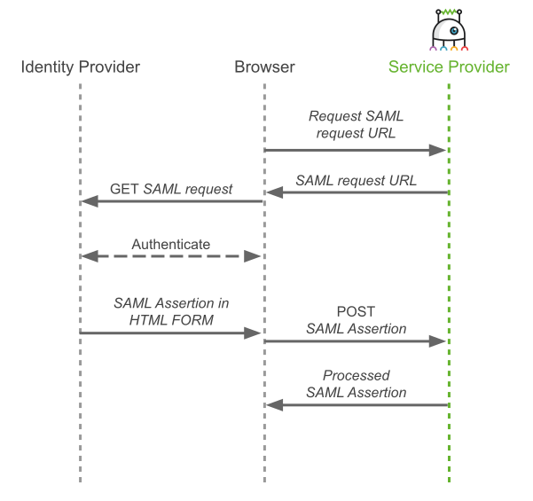

# Single-Sign-On with SAML

The Security Assertion Markup Language (SAML) 2.0 defines the Web Browser Single-Sign-On Profile (for more information see section 4.1 in `https://www.oasis-open.org/committees/download.php/56782/sstc-saml-profiles-errata-2.0-wd-07.pdf`). In this profile the web browser sends a `GET` request containing the SAML request data to the SAML identity provider (IdP); the IdP authenticates the user and then causes the browser to send a `POST` request with the SAML response data containing an assertion with information about the authenticated user to the SAML service provider (SP).



Couper can act as such a SAML service provider: it creates the SAML request URL and processes the SAML response.

Before any such interaction can start, both parties must establish a trust relationship. This is done through the exchange of metadata: the service provider gets metadata about the identity provider (typically in the form of an XML file) and the service provider must provide some information about itself to the identity provider.

In this example we create a `docker-compose` application with two services (see docker-compose.yaml):

* `couper` acts as the service provider (on port 8080) and
* `idp` acts as the (test) identity provider (on port 8083).

In the real world, we will probably use an existing identity provider somewhere else.

```yaml
version: "3"
services:
  couper:
    image: coupergateway/couper
    container_name: couper
    ports:
      - 8080:8080
    volumes:
      - ./couper:/conf
    environment:
      SP_ENTITY_ID: the_sp_entity_id
  idp:
    image: kristophjunge/test-saml-idp
    container_name: idp
    ports:
      - 8083:8080
    environment:
      SIMPLESAMLPHP_SP_ENTITY_ID: the_sp_entity_id
      SIMPLESAMLPHP_SP_ASSERTION_CONSUMER_SERVICE: http://localhost:8080/saml/acs
```

We configure the service provider's metadata:

* The service provider must have an entity ID, which must be known to both the service provider itself and the identity provider. It is set as an environment variable in both services (`SP_ENTITY_ID` in `couper` and `SIMPLESAMLPHP_SP_ENTITY_ID` in `idp`).
* The service provider must tell the identity provider where to send the SAML response. In SAML jargon this is called the assertion consumer service (ACS) URL. In our example it is set in the `idp` service via the `SIMPLESAMLPHP_SP_ASSERTION_CONSUMER_SERVICE` variable.

Now, let's configure Couper as a SAML service provider (couper.hcl).

We start with the `saml` block within the `definitions`:

```hcl
definitions {
  saml "SSO" {
    idp_metadata_file = "idp-metadata.xml"
    sp_entity_id = env.SP_ENTITY_ID
    sp_acs_url = "http://localhost:8080/saml/acs"
    array_attributes = ["eduPersonAffiliation"]
  }
}
```

* `idp_metadata_file` references the file containing the IdP metadata in XML format.
* `sp_entity_id` is the entity ID for the SP defined in the `SP_ENTITY_ID` environment variable.
* `sp_acs_url` is the ACS URL at the SP.
* `array_attributes` contains a list of attributes from the SAML assertion which may have multiple values

In the `server` block we configure an endpoint that returns the SAML request URL:

```hcl
server {
  endpoint "/saml/login" {
    response {
      headers = {
        cache-control = "no-cache,no-store"
      }
      json_body = {
        url = saml_sso_url("SSO")
      }
    }
  }
}

definitions {
...
```

The `saml_sso_url()` function creates this URL from information provided in the `saml` block.

The second endpoint is for the assertion consumer service:

```hcl
server {
  endpoint "/saml/login" {
...
  }

  endpoint "/saml/acs" {
    access_control = ["SSO"]
    response {
      status = 303
      headers = {
        set-cookie = "UserToken=${jwt_sign("UserToken", {
          sub = request.context.SSO.sub
          mail = request.context.SSO.attributes.email
          groups = request.context.SSO.attributes.eduPersonAffiliation
        })};HttpOnly;Secure;Path=/api"
        location = "/"
      }
    }
  }
}

definitions {
...
```

This endpoint is protected by the `saml` access control, which validates the received SAML response and stores some data from the contained SAML assertion in `request.context.SSO`. From this information we create a JWT and send it to the browser via the `set-cookie` header. The `status` code `303` together with the `location` header causes the browser to load the HTML page at `http://localhost:8080/`.

Our simple example also has a small API which is protected by a `jwt` access control configured in the `definitions` (see [JWT Access Control](../jwt-access.control/README.md) for more information):

```hcl
server {
...

  api {
    base_path = "/api"
    access_control = ["UserToken"]
  }
}

definitions {
  jwt "UserToken" {
    signature_algorithm = "HS256"
    key = "Th3$e(rEt"
    cookie = "UserToken"
  }

  saml "SSO" {
...
  }
```

Because the API is the only consumer of the created tokens, we can use the same `jwt` block to configure the `jwt_sign` function in the `"/saml/acs"` endpoint by adding a `signing_ttl` attribute (see [Creating JWT](../creating-jwt/README.md) for more information). The created tokens will expire after one hour:

```hcl
...
definitions {
  jwt "UserToken" {
    signature_algorithm = "HS256"
    key = "Th3$e(rEt"
    cookie = "UserToken"
    signing_ttl = "1h"       # add signing_ttl
  }

  saml "SSO" {
...
  }
```

We add an endpoint to the api block returning the claims from the JWT presented in the `UserToken` cookie:

```hcl
...
  api {
    base_path = "/api"
    access_control = ["UserToken"]

    endpoint "/userinfo" {
      response {
        json_body = request.context.UserToken
      }
    }
  }
...
```

The frontend part of our demo application has only one HTML page (index.html) which is served from the `htdocs` directory:

```hcl
server {
  files {
    document_root = "htdocs"
  }

  endpoint "/saml/login" {
...
```

After loading the page, a request is sent to the API's `/userinfo` endpoint to get and show some information about a user. If the JWT access control rejects the request, a request is sent to the `/saml/login` endpoint creating the SAML request URL, which the browser then calls to start the single sign-on process.

As our demo application is now complete, we can start it:

```sh
$ docker-compose up
```

We point our browser to `http://localhost:8080/`. For a short time, the browser shows the SAML Demo page with a blank textarea, indicating that no information about the user is available.

The browser then loads the identity provider's login form (in case the user is not already logged in at the IdP).

Now enter

* Username: `user1`
* Password: `user1pass`

and submit the login form.

The browser then loads the SAML Demo page again, now showing some user information in JSON format in the textarea.

We can play around with this demo by removing

* either only the `UserToken` cookie (in Chrome-based browsers you may have to make a navigational request to `http://localhost:8080/api/userinfo` to see it in the developer tools),
* or the `UserToken`, `PHPSESSIDIDP` and `SimpleSAMLAuthTokenIdp` cookies.

Watch the network tab of the browser's developer tools to see what happens.
